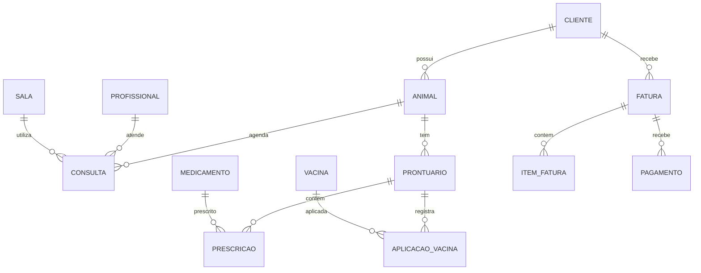

# VetClinic — Sistema de Gestão para Clínica Veterinária

Aplicativo Flutter com SQLite para gestão completa de clínica veterinária, desenvolvido como trabalho acadêmico.

## Requisitos

- Flutter SDK 3.11+
- Windows / Linux / macOS / Android / iOS

## Como executar

```bash
flutter pub get
flutter run -d windows
```

> **Nota:** O banco foi atualizado para a versão 3. Se já rodou antes, desinstale o app ou apague o arquivo `clinica_veterinaria.db` para recriar com dados demo.

## Credenciais de acesso

| Perfil    | E-mail                 | Senha     |
|-----------|------------------------|-----------|
| Admin     | admin@clinica.com      | admin123  |
| Recepção  | recepcao@clinica.com   | recep123  |

Senhas armazenadas com hash SHA-256 + salt.

## Módulos implementados

| Área | Funcionalidades |
|------|-----------------|
| **Cadastros** | Clientes, animais, profissionais, salas |
| **Atendimento** | Consultas, prontuários, consultas de hoje + lembretes |
| **Farmácia** | Medicamentos, vacinas, prescrições, aplicações |
| **Financeiro** | Faturas, itens, pagamentos, relatório |
| **Sistema** | Login, pesquisa por ID, central de alertas, dashboard |

## Regras de negócio

- **Conflito de agenda:** impede duas consultas no mesmo horário para o mesmo profissional/sala
- **Interação medicamentosa:** alerta ao prescrever medicamentos incompatíveis
- **Estoque:** baixa automática ao criar prescrição; alerta de estoque mínimo
- **Faturamento:** total recalculado ao adicionar/remover itens
- **Pagamentos:** status da fatura atualizado (pendente → parcial → pago)
- **Lembretes:** simulação de envio SMS/e-mail na tela Consultas de Hoje

## Arquitetura

```
lib/
├── core/           # Tema, auth, banco, serviços, widgets
├── modules/        # CRUD por entidade (model/repository/controller/page)
└── pages/          # Telas principais (login, dashboard, alertas...)
```

Padrão: **Model → Repository → Controller → Page**

## Banco de dados (SQLite)

14 tabelas relacionadas com chaves estrangeiras:

`usuario`, `cliente`, `animal`, `profissional`, `sala_atendimento`, `consulta`, `prontuario`, `medicamento`, `vacina`, `prescricao`, `aplicacao_vacina`, `fatura`, `item_fatura`, `pagamento`

### Diagrama ER (resumo)



## Dados de demonstração

Na primeira execução são criados automaticamente: 2 clientes, 3 animais, 2 profissionais, consultas de hoje, medicamentos com estoque baixo, fatura com itens, etc.

## Testes

```bash
flutter test
```

## Tecnologias

- Flutter / Dart
- SQLite (`sqflite` + `sqflite_common_ffi` para desktop)
- Provider (estado global de autenticação)
- crypto (hash de senhas)
- intl (formatação de datas e moeda)
